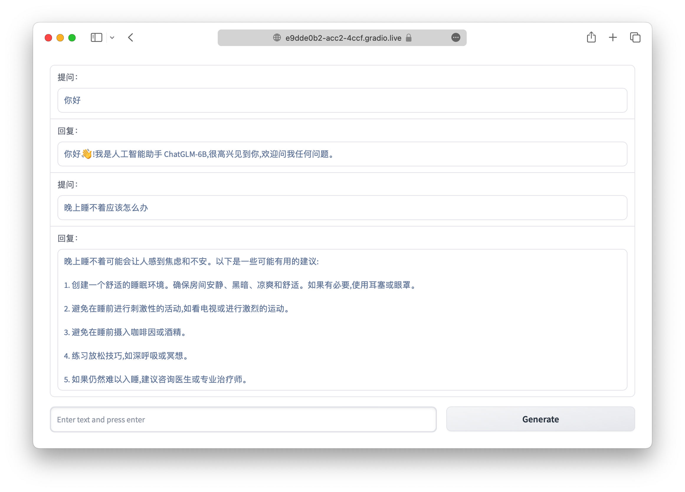

# ChatGLM-6B API

## 介绍

基于可私有部署的 ChatGLM-6B 对话语言模型，使用 fastapi 实现本地 API 部署，并在 web_demo 中提供基于 gradio 的 web 应用案例。

> ChatGLM-6B 是一个开源的、支持中英双语的对话语言模型，基于 [General Language Model (GLM)](https://github.com/THUDM/GLM) 架构，具有 62 亿参数。结合模型量化技术，用户可以在消费级的显卡上进行本地部署（INT4 量化级别下最低只需 6GB 显存）。
ChatGLM-6B 使用了和 ChatGPT 相似的技术，针对中文问答和对话进行了优化。经过约 1T 标识符的中英双语训练，辅以监督微调、反馈自助、人类反馈强化学习等技术的加持，62 亿参数的 ChatGLM-6B 已经能生成相当符合人类偏好的回答。

更多信息请参考 [ChatGLM-6B](https://github.com/THUDM/ChatGLM-6B) 项目。

## 更新

### **20230324** 
1. 修复运行 chatglm_api.py 或 chatglm_api_macos 时可能发生文件中程序执行两次的问题；
2. 在 chatglm_api.py 中增加每次模型运行后清理显存的代码。

特别感谢 [@QNLanYang](https://github.com/QNLanYang/) 提出可以借鉴 [ChatGLM-webui](https://github.com/Akegarasu/ChatGLM-webui/blob/main/modules/model.py) 中清理显存的方案。 

## 使用方式

### 环境安装

使用 pip 安装依赖：`pip install -r requirements.txt`，其中 `transformers` 库版本推荐为 `4.26.1`，但理论上不低于 `4.23.1` 即可。

### 代码调用
0. 下载本仓库
```shell
git clone https://github.com/imClumsyPanda/ChatGLM-6B-API
cd ChatGLM-6B-API
```
1. 首先运行 chatglm_api 脚本
- Windows 或 Linux 系统请运行 [chatglm_api.py](chatglm_api.py)
- MacOS 系统请将完整模型下载至本地后，运行 [chatglm_api_macos.py](chatglm_api_macos.py)，脚本中模型存储路径为"./chatglm_hf_model/"，可依据实际情况进行修改。
- 完整的模型实现可以在 [Hugging Face Hub](https://huggingface.co/THUDM/chatglm-6b) 上查看。如果你从Hugging Face Hub上下载checkpoint的速度较慢，也可以从[这里](https://cloud.tsinghua.edu.cn/d/fb9f16d6dc8f482596c2/)手动下载。

2. chatglm_api 脚本正常运行后，可以通过如下代码调用 ChatGLM-6B 模型来生成对话：

```python
>>> import requests
>>> user_msg, history = "你好", []
>>> resp = requests.post(f"http://127.0.0.1:8080/predict?user_msg={user_msg}", json=history)
>>> if resp.status_code == 200:
>>>     response, history = resp.json()["response"], resp.json()["history"]
>>>     print(response)
你好👋!我是人工智能助手 ChatGLM-6B,很高兴见到你,欢迎问我任何问题。
>>> user_msg = "晚上睡不着该怎么办"
>>> resp = requests.post(f"http://127.0.0.1:8080/predict?user_msg={user_msg}", json=history)
>>> if resp.status_code == 200:
>>>     response, history = resp.json()["response"], resp.json()["history"]
>>>     print(response)
晚上睡不着可能会让你感到焦虑或不舒服,但以下是一些可以帮助你入睡的方法:

1. 制定规律的睡眠时间表:保持规律的睡眠时间表可以帮助你建立健康的睡眠习惯,使你更容易入睡。尽量在每天的相同时间上床,并在同一时间起床。
2. 创造一个舒适的睡眠环境:确保睡眠环境舒适,安静,黑暗且温度适宜。可以使用舒适的床上用品,并保持房间通风。
3. 放松身心:在睡前做些放松的活动,例如泡个热水澡,听些轻柔的音乐,阅读一些有趣的书籍等,有助于缓解紧张和焦虑,使你更容易入睡。
4. 避免饮用含有咖啡因的饮料:咖啡因是一种刺激性物质,会影响你的睡眠质量。尽量避免在睡前饮用含有咖啡因的饮料,例如咖啡,茶和可乐。
5. 避免在床上做与睡眠无关的事情:在床上做些与睡眠无关的事情,例如看电影,玩游戏或工作等,可能会干扰你的睡眠。
6. 尝试呼吸技巧:深呼吸是一种放松技巧,可以帮助你缓解紧张和焦虑,使你更容易入睡。试着慢慢吸气,保持几秒钟,然后缓慢呼气。

如果这些方法无法帮助你入睡,你可以考虑咨询医生或睡眠专家,寻求进一步的建议。
```

### Demo

本项目基于 [ChatGLM-6B](https://github.com/THUDM/ChatGLM-6B) 提供的 Demo，提供一个基于 [Gradio](https://gradio.app) 的网页版 Demo 和一个命令行 Demo。

#### 网页版 Demo



首先安装 Gradio：`pip install gradio`，然后运行仓库中的 [web_demo.py](web_demo.py)： 

```shell
python web_demo.py
```

程序会运行一个 Web Server，并输出地址。在浏览器中打开输出的地址即可使用。

#### 命令行 Demo


运行仓库中 [cli_demo.py](cli_demo.py)：

```shell
python cli_demo.py
```

程序会在命令行中进行交互式的对话，在命令行中输入指示并回车即可生成回复，输入`clear`可以清空对话历史，输入`stop`终止程序。

